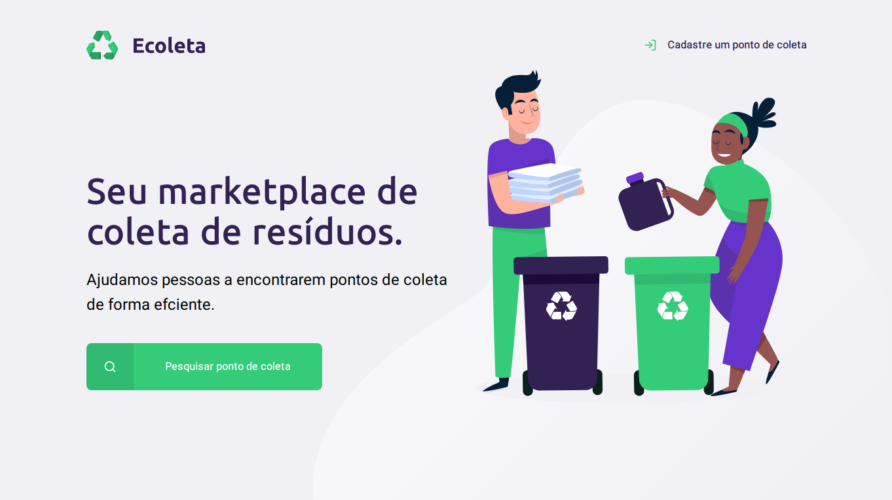

<div align="center">


</div>

### Web Screenshot
<div align="center">
   
</div>

# :computer: Technologies
This project was made using the following technologies:
<ul>
  <li><a href="https://www.typescriptlang.org/">Typescript</a></li>
  <li><a href="https://reactjs.org/">ReactJS</a></li>
  <li><a href="https://reactnative.dev/">React Native</a></li>
  <li><a href="https://expo.io/">Expo</a></li>
  <li><a href="https://nodejs.org/en/">NodeJS</a></li>
  <li><a href="https://expressjs.com/">ExpressJS</a></li>
</ul>

# :construction_worker: How to run
```bash
# Clone Repository
$ git clone https://github.com/vinicius-masiero/Ecoleta.git
```
### 📦 Run API

```bash
# Go to server folder
$ cd Ecoleta/server

# Install dependencies
$ yarn install

# Run application
$ yarn start
```
Access API at http://localhost:3333/

### 💻 Run Web Project

```bash
# Go to web folder
$ cd Ecoleta/web

# Install dependencies
$ yarn install

# Run application
$ yarn start
```
Open the project at http://localhost:3000/

### 📱 Run Mobile Project
To run the mobile project you need a smartphone with the [expo](https://play.google.com/store/apps/details?id=host.exp.exponent) app installed or an android/ios emulator.
<br />
After, fork this repository and clone to your machine. Inside of the project's folder run the following commands:

```bash
# Go to mobile folder
$ cd Ecoleta/mobile

# Install dependencies
$ yarn install

# Run application
$ yarn start
```
After, read the QRCode using the [expo](https://play.google.com/store/apps/details?id=host.exp.exponent) app or run using an emulator.
